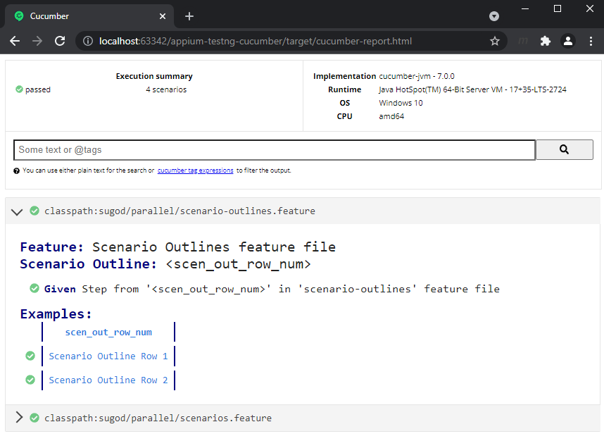
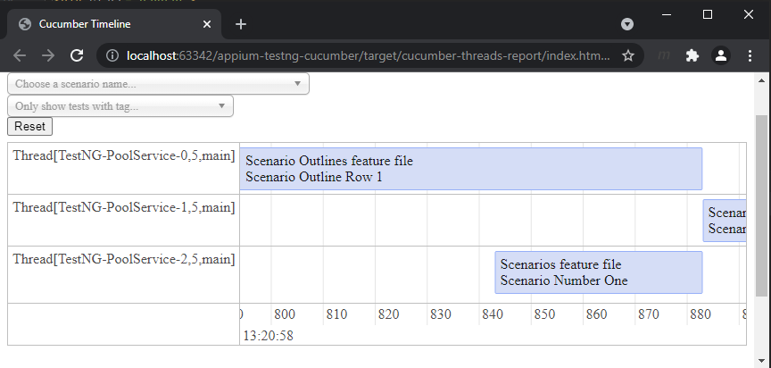
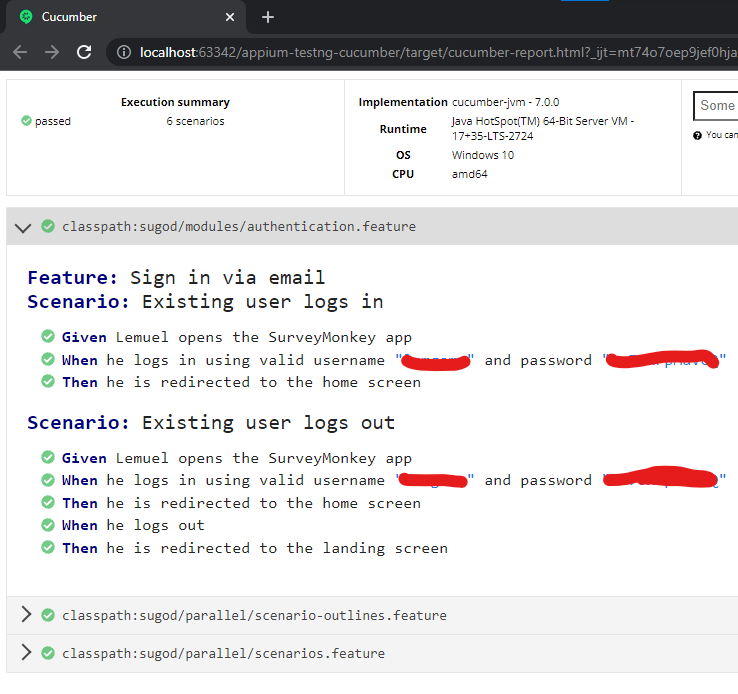

## Pre-requisite
1. Install java
2. Install mvn
3. [Install Appium Desktop and Android SDK](https://appium.io/docs/en/about-appium/getting-started/?lang=en)

## Steps
1. Generate maven project from archetype. By default, **JUnit4 is used in pom.xml**.
```bash
mvn archetype:generate                      \
   "-DarchetypeGroupId=io.cucumber"           \
   "-DarchetypeArtifactId=cucumber-archetype" \
   "-DarchetypeVersion=6.10.4"               \
   "-DgroupId=io.github.lemgrb"                  \
   "-DartifactId=appium-testng-cucumber"               \
   "-Dpackage=sugod"                  \
   "-Dversion=1.0.0-SNAPSHOT"                 \
   "-DinteractiveMode=false" 
```
2. **Replace JUnit with TestNG and use Failsafe.** See [Parallel Execution
   ](https://cucumber.io/docs/guides/parallel-execution/). In JUnit the feature files are run in parallel rather than scenarios, which means all the scenarios in a feature file will be executed by the same thread. In TestNG the scenarios and rows in a scenario outline are executed in multiple threads. To run, use `mvn integration-test` or `mvn verify`.
3. **Add Reports** : 
   1. For HTML Report, specify in command line `-Dcucumber.plugin="html:target\cucumber"` or `@CucumberOptions`
      
   2. For Visual representation of threads, `@CucumberOptions(plugin= {"timeline:<report folder>"})`
      
4. Add Appium's 'java-client'. See [How to install latest java client Beta/Snapshots](https://github.com/appium/java-client#how-to-install-latest-java-client-betasnapshots)
5. Add example Gherkin and glue code for Login feature. See templates from [The starting of an app](https://github.com/appium/java-client/blob/master/docs/The-starting-of-an-Android-app.md)
   