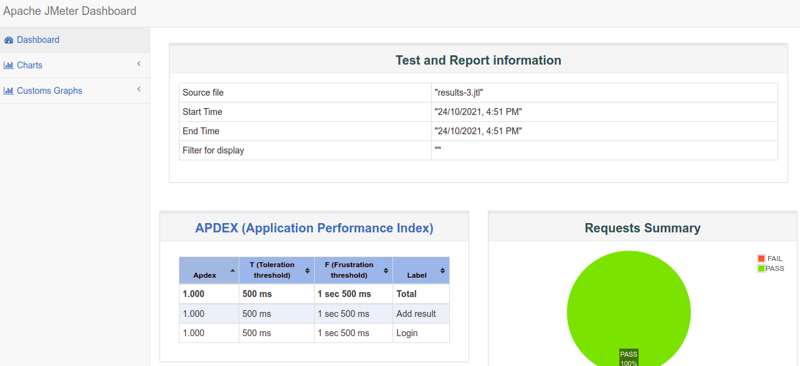

This sample use jmeter as functional testing tool, not load/stress.

API: 
+ Login `POST /auth/local`
+ Insert result `POST /game-results`

## Other plugins esp. for load/stress testing

Download "3 Basic Graphs" and "5 Additional Graphs" on [JMeter Plugins :: JMeter-Plugins.org](http://jmeter-plugins.org/) 
 
## Areas of concern

| Concern | Implemented | Comment |
|---|---|---|
| Data-driven tests | ✔ | Using CSV data set config   |
| Logging and telemetry | ✔ | Use log.info in beanshell |
| Where are the test cases 'stored'? | ✔ |  'Test plan'. See [Element of test plan](https://jmeter.apache.org/usermanual/test_plan.html) |
| Test data management | ✔ | CSV Data set config  |
| Assertion library | ✔ | e.g. ResponseAssertion |
| CLI execution  | ✔ | `$ sh jmeter.sh -n` |
| Reports | ✔ | `jmeter.sh -n -t ThreadGroup.jmx -l results.jtl -e -o results` and other plugins |

## Run from CLI

CLI: `sh jmeter.sh -n -t INSERT_GAME_RESULTS.jmx -l results-3.jtl -e -o results3`

Screenshot:

