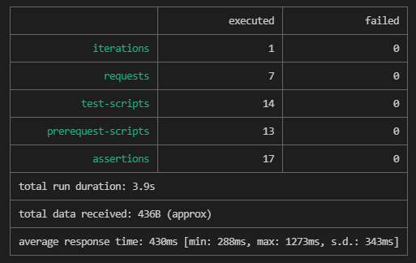

Example API Resource is https://www.crudcrud.com/api/{{endpoint}}/books

API: 
+ Create books `POST /{{endpoint}}/books`
+ Get all books `GET /{{endpoint}}/books`
+ Delete book `DELETE /{{endpoint}}/books/{{id}}`
 
 ## Areas of concern

| Concern | Implemented | Comment |
|---|---|---|
| Data-driven tests | ✔ | Go to Collection Runner > "Select file"   |
| Logging and telemetry | ✔ | console.log |
| Where are the test cases 'stored'? | ✔ |  'Tests' tab in every request |
| Test data management | ✔ | Can do API call in "Pre-request Script" tab or via Collection Runner > "Select file"   |
| Assertion library | ✔ | Use `pm.expect`. See [Test Scripts Example](https://learning.postman.com/docs/writing-scripts/script-references/test-examples/)|
| CLI execution  | ✔ | `npm install -g newman` |
| Reports | ✔ | CLI, JSON |

## Run from CLI

1. Install [newman](https://learning.postman.com/docs/running-collections/using-newman-cli/command-line-integration-with-newman/): `$ npm install -g newman`
2. Run `$ newman run crudcrud.postman_collection.json -e test.postman_environment.json -d data.json --reporters cli,json --reporter-json-export testresults.json`

> Use --bail so exit code is '1' : useful for CI/CD

Example test result:

CLI:

File: 

See [testresults.json](testresults.json)